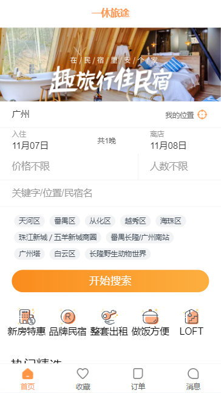
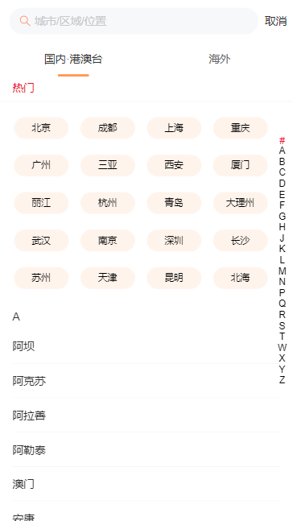

# 一休旅途 m_trip
<del>[https://m.tujia.com](https://m.tujia.com/)</del>






---
---

1171 0325
---
1. 配置样式重置 normalize.css reset.css
2. 配置路由导航
3. pinia 状态管理
4. tab-bar 路由切换
5. 使用UI库 Vant   indexBar 索引栏


---
修改第三方UI组件库的样式
1. 用插槽，插入自己的元素，那么在自己的作用域中直接修改这个元素
2. 全局定义一个变量，覆盖它默认变量的值，缺点：全局修改
3. 局部 定义一个变量，覆盖它默认变量的值，有点：局部修改
4. 直接找到对应的子组件的选择器，进行修改，:deep(子组件中的元素的选择器)进行修改 直接修改css

---
city页面，就需要将tabbar隐藏
1. useRoute.meta   useRoute获取当前活跃路由  v-if 隐藏
2. 设置city的`z-index;height: 100vh;bg` 可以抽出来到common.css 

---
city.vue <-> cityStore(state, actions) -> city.js

---

city 国内，海外 切换数据的时候，渲染速度慢

直接创建两个city-group，然后通过v-show，v-if 和v-show区别？TODO
虚拟列表？ TODO

---
day11

router({
	query 
})

---
下拉滚动加载更多
直接使用window  离开页面时，需要移除监听

keep-alive

underscore 防抖节流

抽取hook 好处

计算属性 缓存。
使用计算属性的情况
标识符，监听到变化之后 写js逻辑

---

根据网址进入 路由。
tabbar active没有切换 缺少route属性
currentIndex 没有切换

---
在拦截器里面添加 loading

---

detail 动态路由，/detail/:id


---

route 和  router区别

---

滚动，不是window在滚动，而是页面元素div在滚动


---

接口：[https://documenter.getpostman.com/view/12387168/UzXPxcSi](https://documenter.getpostman.com/view/12387168/UzXPxcSi)

## 一. 首页

GET

### 1.1. 热门建议

http://codercba.com:1888/api/home/hotSuggests

Example Request

热门建议

```js
var requestOptions = {
  method: 'GET',
  redirect: 'follow'
};

fetch("http://codercba.com:1888/api/home/hotSuggests", requestOptions)
  .then(response => response.text())
  .then(result => console.log(result))
  .catch(error => console.log('error', error));
```

GET

### 1.2. 推荐类别

http://codercba.com:1888/api/home/categories

Example Request

推荐类别

```js
var requestOptions = {
  method: 'GET',
  redirect: 'follow'
};

fetch("http://codercba.com:1888/api/home/categories", requestOptions)
  .then(response => response.text())
  .then(result => console.log(result))
  .catch(error => console.log('error', error));
```

GET

### 1.3. 房屋列表

http://codercba.com:1888/api/home/houselist?page=1

PARAMS

page

1


Example Request

房屋列表

```js
var requestOptions = {
  method: 'GET',
  redirect: 'follow'
};

fetch("http://codercba.com:1888/api/home/houselist?page=1", requestOptions)
  .then(response => response.text())
  .then(result => console.log(result))
  .catch(error => console.log('error', error));
```

## 城市

GET

### 所有城市

http://codercba.com:1888/api/city/all

Example Request

所有城市

```js
var requestOptions = {
  method: 'GET',
  redirect: 'follow'
};

fetch("http://codercba.com:1888/api/city/all", requestOptions)
  .then(response => response.text())
  .then(result => console.log(result))
  .catch(error => console.log('error', error));
```

## 二. 详情

GET

### 2.1. 房子详情

http://codercba.com:1888/api/favor/list

Example Request

房子详情

```js
var requestOptions = {
  method: 'GET',
  redirect: 'follow'
};

fetch("http://codercba.com:1888/api/favor/list", requestOptions)
  .then(response => response.text())
  .then(result => console.log(result))
  .catch(error => console.log('error', error));
```

## 三. 收藏

GET

### 3.1. 收藏列表

http://codercba.com:1888/api/favor/list

Example Request

收藏列表

```js
var requestOptions = {
  method: 'GET',
  redirect: 'follow'
};

fetch("http://codercba.com:1888/api/favor/list", requestOptions)
  .then(response => response.text())
  .then(result => console.log(result))
  .catch(error => console.log('error', error));
```

GET

### 3.2. 浏览历史

http://codercba.com:1888/api/favor/history

Example Request

浏览历史

```js
var requestOptions = {
  method: 'GET',
  redirect: 'follow'
};

fetch("http://codercba.com:1888/api/favor/history", requestOptions)
  .then(response => response.text())
  .then(result => console.log(result))
  .catch(error => console.log('error', error));
```

## 四. 订单

GET

### 4.1. 订单列表

http://codercba.com:1888/api/order/list?type=pend

type=pend 未完成订单 type=recent 最近订单 type=all 全部订单


Example Request

订单列表

```js
var requestOptions = {
  method: 'GET',
  redirect: 'follow'
};

fetch("http://codercba.com:1888/api/order/list?type=pend", requestOptions)
  .then(response => response.text())
  .then(result => console.log(result))
  .catch(error => console.log('error', error));
```

## 五. 搜索

GET

### 5.1. 搜索顶部

http://codercba.com:1888/api/search/top

Example Request

搜索顶部

```javascript
var requestOptions = {
  method: 'GET',
  redirect: 'follow'
};

fetch("http://codercba.com:1888/api/search/top", requestOptions)
  .then(response => response.text())
  .then(result => console.log(result))
  .catch(error => console.log('error', error));
```

GET

### 5.2. 搜素结果

http://codercba.com:1888/api/search/result

Example Request

搜素结果

```javascript
var requestOptions = {
  method: 'GET',
  redirect: 'follow'
};

fetch("http://codercba.com:1888/api/search/result", requestOptions)
  .then(response => response.text())
  .then(result => console.log(result))
  .catch(error => console.log('error', error));
```

---
---

This template should help get you started developing with Vue 3 in Vite.

## Recommended IDE Setup

[VSCode](https://code.visualstudio.com/) + [Volar](https://marketplace.visualstudio.com/items?itemName=Vue.volar) (and disable Vetur) + [TypeScript Vue Plugin (Volar)](https://marketplace.visualstudio.com/items?itemName=Vue.vscode-typescript-vue-plugin).

## Customize configuration

See [Vite Configuration Reference](https://vitejs.dev/config/).

## Project Setup

```sh
npm install
```

### Compile and Hot-Reload for Development

```sh
npm run dev
```

### Compile and Minify for Production

```sh
npm run build
```
